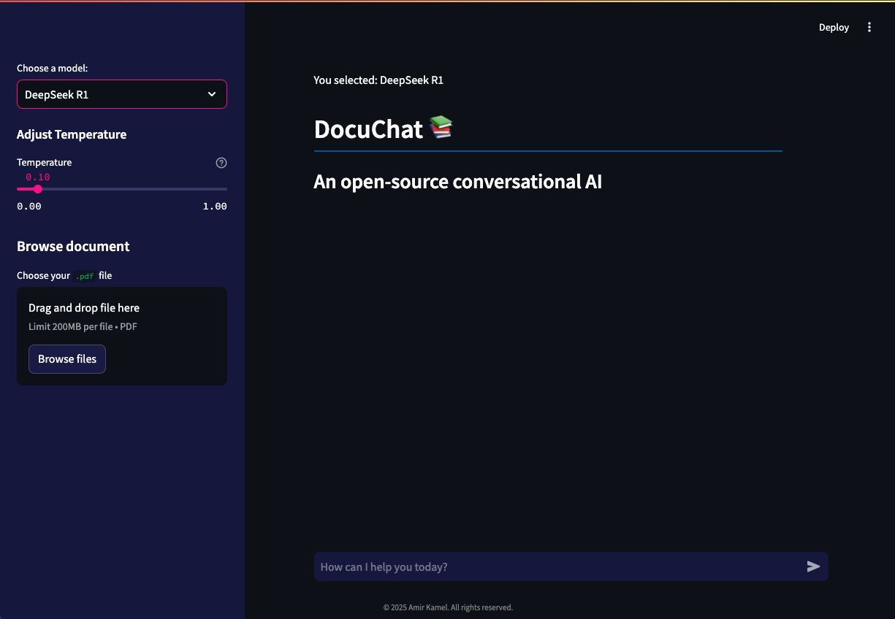

# A Proposed RAG Architecture

This is an open source AI chat assistant, developed with Deep Seek R1 and Llama 3.2




## Prerequisites
- python-dotenv
- streamlit
- llama-index
- llama-index-embeddings-huggingface
- llama-index-llms-ollama
- llama-index-llms-huggingface
- huggingface_hub
- IPython

## Setup

1. **Clone the repository:**

    ```sh
    cd DocuChat
    ```

2. **Create a virtual environment:**

    ```sh
    python -m venv venv
    ```

3. **Activate the virtual environment:**

    - On Windows:

        ```sh
        venv\Scripts\activate
        ```

    - On macOS/Linux:

        ```sh
        source venv/bin/activate
        ```

4. **Install the required packages:**

    ```sh
    pip install -r requirements.txt
      ```

## License

This project is licensed under the MIT License.